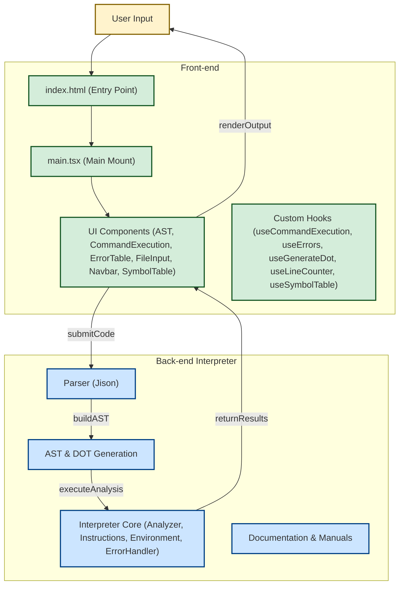

# OLC1_Proyecto2_202100106
1.Diagrama

```mermaid
flowchart TB
    %% External Node
    U["User Input"]:::external

    %% Front-end Subgraph
    subgraph "Front-end"
        FE3["index.html (Entry Point)"]:::frontend
        FE4["main.tsx (Main Mount)"]:::frontend
        FE1["UI Components (AST, CommandExecution, ErrorTable, FileInput, Navbar, SymbolTable)"]:::frontend
        FE2["Custom Hooks (useCommandExecution, useErrors, useGenerateDot, useLineCounter, useSymbolTable)"]:::frontend
    end

    %% Back-end Interpreter Subgraph
    subgraph "Back-end Interpreter"
        BE1["Parser (Jison)"]:::backend
        BE2["AST & DOT Generation"]:::backend
        BE3["Interpreter Core (Analyzer, Instructions, Environment, ErrorHandler)"]:::backend
        BE4["Documentation & Manuals"]:::backend
    end

    %% Flow Connections
    U --> FE3 --> FE4 --> FE1
    FE1 -->|"submitCode"| BE1
    BE1 -->|"buildAST"| BE2
    BE2 -->|"executeAnalysis"| BE3
    BE3 -->|"returnResults"| FE1
    FE1 -->|"renderOutput"| U

    %% Class Definitions for styling
    classDef backend fill:#cce5ff,stroke:#004085,stroke-width:2px;
    classDef frontend fill:#d4edda,stroke:#155724,stroke-width:2px;
    classDef external fill:#fff3cd,stroke:#856404,stroke-width:2px;

    %% Click Events
    click BE1 "https://github.com/sudokentucky/olc1_proyecto2_202100106/blob/main/back-end/Grammar/parser.jison"
    click BE3 "https://github.com/sudokentucky/olc1_proyecto2_202100106/tree/main/back-end/src/Analizador"
    click BE2 "https://github.com/sudokentucky/olc1_proyecto2_202100106/tree/main/back-end/src/Analizador/Tree"
    click BE4 "https://github.com/sudokentucky/olc1_proyecto2_202100106/tree/main/back-end/Documentacion"
    click FE1 "https://github.com/sudokentucky/olc1_proyecto2_202100106/tree/main/front-end/src/components"
    click FE2 "https://github.com/sudokentucky/olc1_proyecto2_202100106/tree/main/front-end/src/hooks"
    click FE3 "https://github.com/sudokentucky/olc1_proyecto2_202100106/blob/main/front-end/index.html"
    click FE4 "https://github.com/sudokentucky/olc1_proyecto2_202100106/blob/main/front-end/src/main.tsx"

```
